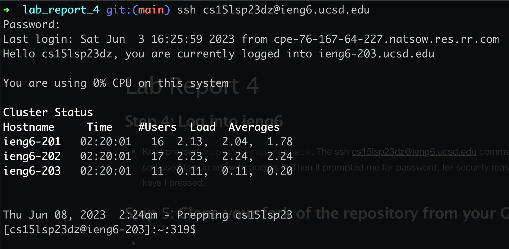
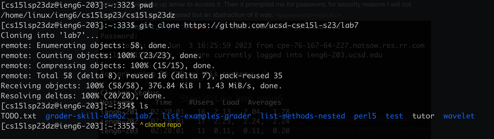
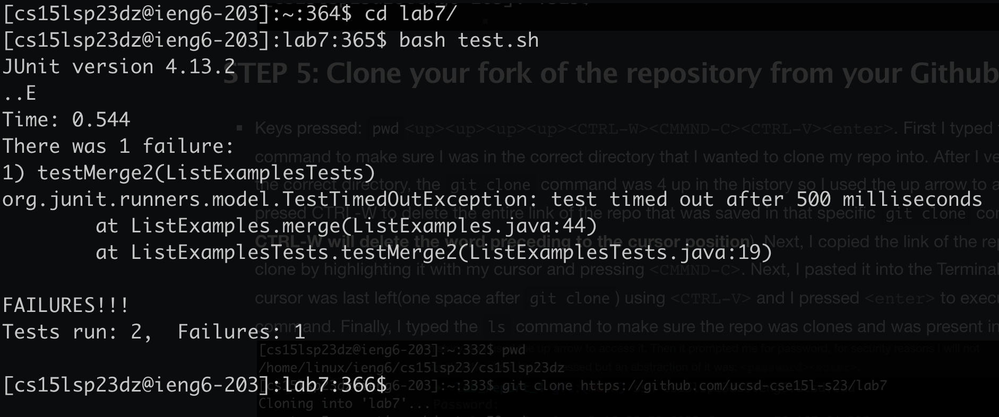
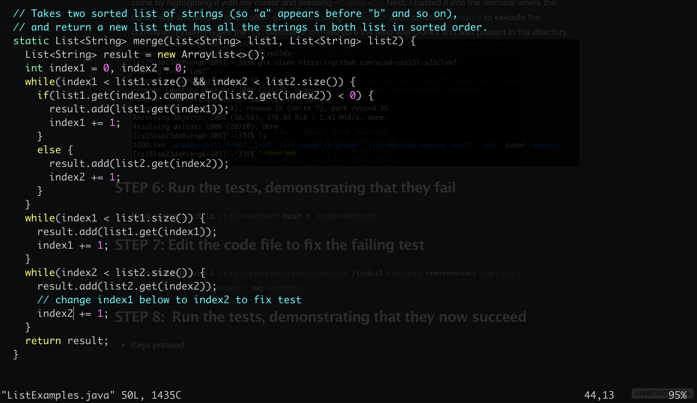
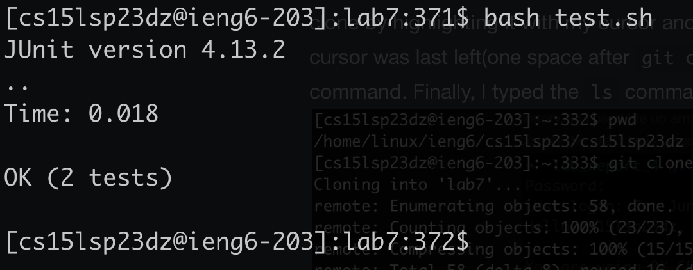
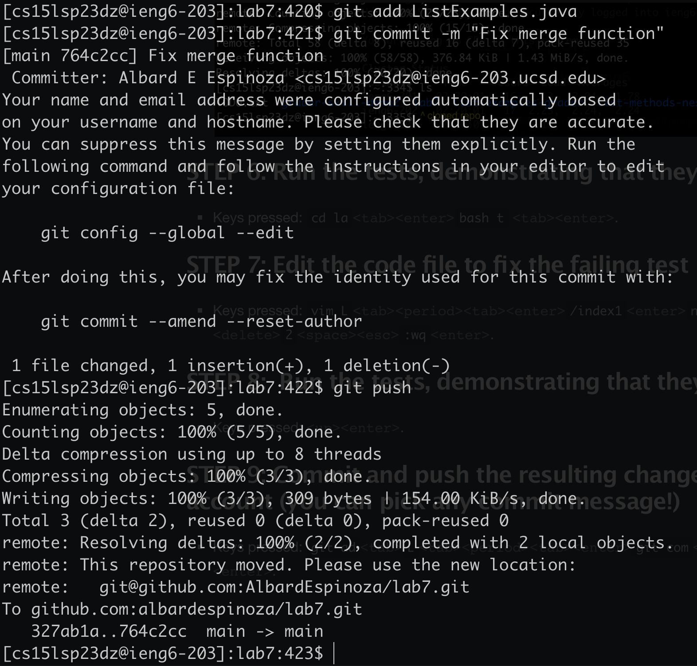

# Lab Report 4

## STEP 4: Log into ieng6

* Keys pressed: <up><up><up><enter>. The ```ssh cs15lsp23dz@ieng6.ucsd.edu``` command was 3 up in the history, so I used the up arrow to access it. Then it prompted me for password, for security reasons I will not display the exact keys I pressed but an abstraction of it was: <password><enter>.


## STEP 5: Clone your fork of the repository from your Github account

* Keys pressed: ```pwd``` <up><up><up><up><CTRL-W><CMMND-C><CTRL-V><enter>. First, I typed the ```pwd``` command to make sure I was in the correct directory that I wanted to clone my repo into. After I verified I was in the correct directory, the ```git clone``` command was 4 up in the history so I used the up arrow to access it. Next, I presed CTRL-W to delete the entire link of the repo that was saved in that specific ```git clone``` command(**NOTE: CTRL-W will delete the word preceding to the cursor position**). Next, I copied the link of the repo I wanted to clone by highlighting it with my cursor and pressing <CMMND-C>. Next, I pasted it into the Terminal where the cursor was last left(one space after ```git clone```) using <CTRL-V> and I pressed <enter> to execute the command. Finally, I typed the ```ls``` command to make sure the repo was clones and was present in the directory. 


## STEP 6: Run the tests, demonstrating that they fail

* Keys pressed: ```cd la``` <tab><enter> ```bash t``` <tab><enter>. 


## STEP 7: Edit the code file to fix the failing test

* Keys pressed: ```vim L``` <tab><period><tab><enter> ```/index1``` <enter> ```nnnnnnnnnwi``` <delete><delete> ```2``` <space><esc> ```:wq``` <enter>.


## STEP 8:  Run the tests, demonstrating that they now succeed

* Keys pressed: <up><enter>.


## STEP 9: Commit and push the resulting change to your Github account (you can pick any commit message!)

* Keys pressed: ```git ad``` <tab> ```L``` <tab><period><tab><enter> ```git com``` <tab> ```-m "Fixed merge function"``` <enter> ```git push```.

