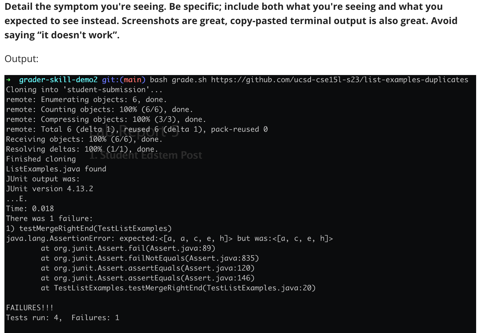

# Lab Report 5

## Part 1 - Debugging Scenario

**1. Student Edstem Post**





**2. TA Response**

* I have mimicked your setup, and I was able to reproduce the exact symptom you displayed. I looked into the repos you provided and took a closer look at TestListExamples.java, grade.sh, and ListExamples.java. I believe the issue pertains to ListExamples.merge method. Have you thought about how to handle the case where the same character is present in both lists and how you're adding them to the result list? Please think about this and let me know your results. I added an image below for reference.

  

**3. Student Respone**

* I was able to fix it, you were right the bug was in the edge case where both lists contained the same character. I did not notice that. I was able to fix that edge case. If you take a closer look at the code, lines 32-36 when I handle the case with the failure inducing input where the two lists contain the same character, I added the character once, and I increased the indices of both lists by 1, so one of the characters gets excluded from the result list. Therefore, the test in TestListExamples that handles that edge case failed. 

* Output:

  

**4. SETUP:**

* File and directory structure:

  * All that you need is to clone the following two repos which have the correct files and directory structure: [https://github.com/AlbardEspinoza/grader-skill-demo2](https://github.com/AlbardEspinoza/grader-skill-demo2) and [https://github.com/AlbardEspinoza/list-examples-duplicates](https://github.com/AlbardEspinoza/list-examples-duplicates).

* Contents of the files before the fix:

  * **ListExamples.java**

    ```Java
    import java.util.ArrayList;
    import java.util.List;
    
    interface StringChecker { boolean checkString(String s); }
    
    class ListExamples {
    
      // Returns a new list that has all the elements of the input list for which
      // the StringChecker returns true, and not the elements that return false, in
      // the same order they appeared in the input list;
      static List<String> filter(List<String> list, StringChecker sc) {
        List<String> result = new ArrayList<>();
        for(String s: list) {
          if(sc.checkString(s)) {
            result.add(s);
          }
        }
        return result;
      }
    
    
      // Takes two sorted list of strings (so "a" appears before "b" and so on),
      // and return a new list that has all the strings in both list in sorted order.
      static List<String> merge(List<String> list1, List<String> list2) {
        List<String> result = new ArrayList<>();
        int index1 = 0, index2 = 0;
        while(index1 < list1.size() && index2 < list2.size()) {
          if(list1.get(index1).compareTo(list2.get(index2)) < 0) {
            result.add(list1.get(index1));
            index1 += 1;
          }
          else if (list1.get(index1).compareTo(list2.get(index2)) == 0) {
            result.add(list1.get(index1));
            index1 += 1;
            index2 += 1;
          }
          else {
            result.add(list2.get(index2));
            index2 += 1;
          }
        }
        while(index1 < list1.size()) {
          result.add(list1.get(index1));
          index1 += 1;
        }
        while(index2 < list2.size()) {
          result.add(list2.get(index2));
          index2 += 1;
        }
        return result;
      }
    
    
    }
    ```

  * **TestListExamples.java**

    ```Java
    import static org.junit.Assert.*;
    import org.junit.*;
    import java.util.Arrays;
    import java.util.List;
    
    class IsMoon implements StringChecker {
      public boolean checkString(String s) {
        return s.equalsIgnoreCase("moon");
      }
    }
    
    public class TestListExamples {
    
      @Test(timeout = 500)
      public void testMergeRightEnd() {
        List<String> left = Arrays.asList("a", "c", "e");
        List<String> right = Arrays.asList("a", "h");
        List<String> merged = ListExamples.merge(left, right);
        List<String> expected = Arrays.asList("a", "a", "c", "e", "h");
        assertEquals(expected, merged);
      }
    
      @Test(timeout = 500)
      public void testMergeLeftEnd() {
        List<String> left = Arrays.asList("a", "c", "z");
        List<String> right = Arrays.asList("b", "d");
        List<String> merged = ListExamples.merge(left, right);
        List<String> expected = Arrays.asList("a", "b", "c", "d", "z");
        assertEquals(expected, merged);
      }
    
      @Test(timeout = 500)
      public void testFilterSingle() {
        List<String> input = Arrays.asList("Moon", "MOO", "moo");
        List<String> expect = Arrays.asList("Moon");
        List<String> filtered = ListExamples.filter(input, new IsMoon());
        assertEquals(expect, filtered);
      }
    
      @Test(timeout = 500)
      public void testFilterMulti() {
        List<String> input = Arrays.asList("Moon", "MOO", "moon", "MOON");
        List<String> expect = Arrays.asList("Moon", "moon", "MOON");
        List<String> filtered = ListExamples.filter(input, new IsMoon());
        assertEquals(expect, filtered);
      }
    }
    ```

  * **grade.sh**

    ```bash
    CPATH='.:lib/hamcrest-core-1.3.jar:lib/junit-4.13.2.jar'
    
    rm -rf student-submission
    rm -rf grading-area
    
    mkdir grading-area
    
    git clone $1 student-submission
    echo 'Finished cloning'
    
    if [[ -f student-submission/ListExamples.java ]]
    then
      echo 'ListExamples.java found'
    else
      echo 'ListExamples.java not found'
      echo 'Score: 0/4'
      exit 1
    fi
    
    cp student-submission/ListExamples.java ./grading-area
    
    cp TestListExamples.java grading-area/
    cp -r lib grading-area/
    
    cd grading-area
    
    javac -cp $CPATH *.java
    
    java -cp $CPATH org.junit.runner.JUnitCore TestListExamples > junit-output.txt
    
    # The strategy used here relies on the last few lines of JUnit output, which
    # looks like:
    
    # FAILURES!!!
    # Tests run: 4,  Failures: 2
    
    # We check for "FAILURES!!!" and then do a bit of parsing of the last line to
    # get the count
    FAILURES=`grep -c FAILURES!!! junit-output.txt`
    
    
    if [[ $FAILURES -eq 0 ]]
    then
      RESULT_LINE=`grep "OK " junit-output.txt`
      PASSED=${RESULT_LINE:4:1}
      TOTAL=$PASSED
    else
      # The ${VAR:N:M} syntax gets a substring of length M starting at index N
      # Note that since this is a precise character count into the "Tests run:..."
      # string, we'd need to update it if, say, we had a double-digit number of
      # tests. But it's nice and simple for the purposes of this script.
    
      # See, for example:
      # https://stackoverflow.com/questions/16484972/how-to-extract-a-substring-in-bash
      # https://www.gnu.org/savannah-checkouts/gnu/bash/manual/bash.html#Shell-Parameter-Expansion
    
      RESULT_LINE=`grep "Tests run:" junit-output.txt`
      COUNT=${RESULT_LINE:25:1}
      TOTAL=${RESULT_LINE:11:1}
    
      PASSED=$(echo "($TOTAL-$COUNT)" | bc)
    
      echo "JUnit output was:"
      cat junit-output.txt
    fi
    
    echo ""
    echo "--------------"
    echo "| Score: $PASSED/$TOTAL |"
    echo "--------------"
    echo ""
    
    ```

* Commands to trigger the bug:

  * ```bash
    cd <absolute_path_into_grader_skill_demo_2_directory>
    bash grader.sh https://github.com/AlbardEspinoza/list-examples-duplicates
    ```

* Description of what to edit to fix the bug

  * To fix the bug the only thing needed is to delete lines 32-36 in ListExamples.java, so the resulting file should be this:

    ```java
    import java.util.ArrayList;
    import java.util.List;
    
    interface StringChecker { boolean checkString(String s); }
    
    class ListExamples {
    
      // Returns a new list that has all the elements of the input list for which
      // the StringChecker returns true, and not the elements that return false, in
      // the same order they appeared in the input list;
      static List<String> filter(List<String> list, StringChecker sc) {
        List<String> result = new ArrayList<>();
        for(String s: list) {
          if(sc.checkString(s)) {
            result.add(s);
          }
        }
        return result;
      }
    
    
      // Takes two sorted list of strings (so "a" appears before "b" and so on),
      // and return a new list that has all the strings in both list in sorted order.
      static List<String> merge(List<String> list1, List<String> list2) {
        List<String> result = new ArrayList<>();
        int index1 = 0, index2 = 0;
        while(index1 < list1.size() && index2 < list2.size()) {
          if(list1.get(index1).compareTo(list2.get(index2)) < 0) {
            result.add(list1.get(index1));
            index1 += 1;
          }
          else {
            result.add(list2.get(index2));
            index2 += 1;
          }
        }
        while(index1 < list1.size()) {
          result.add(list1.get(index1));
          index1 += 1;
        }
        while(index2 < list2.size()) {
          result.add(list2.get(index2));
          index2 += 1;
        }
        return result;
      }
    
    
    }
    ```

## Part 2 - Reflection

* I think the coolest thing that I've learned in the second half of this quarter was how to make an autograder script in bash. It was very interesting how we could compose a file with multiple commands to automate a task. It will be helpful in other areas like I will attempt to build a bash script that takes any link and converts all the text into a PDF file.